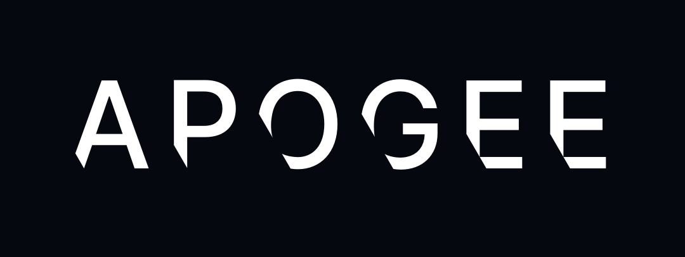

<p align="center">
  
</p>

<p align="center">
  <strong>The highest vantage point over your Claude Code agents.</strong>
</p>

apogee is a single-binary observability dashboard for multi-agent [Claude Code](https://docs.claude.com/en/docs/claude-code) sessions. It captures every hook event, builds OpenTelemetry-shaped traces out of them, stores everything in DuckDB, and streams the result to a dark, NASA-inspired Next.js dashboard that ships embedded in the Go binary. Each Claude Code user turn becomes one OTel trace; every tool call, subagent run, and HITL request inside that turn becomes a child span.

> [!WARNING]
> apogee is under active development. APIs, schemas, and the on-disk format can break between commits until the first tagged release.

---

## Why apogee

Running multi-agent Claude Code workflows means losing sight of what each agent is actually doing — which tools fire, which permissions get asked, which commands get blocked, which subagent is stuck. apogee answers four questions at a glance:

1. **Where should I look right now?** — a rule-based attention engine buckets every turn into `healthy / watchlist / watch / intervene_now` and sorts the live list accordingly.
2. **What is this turn doing at this moment?** — phase heuristics (plan / explore / edit / test / commit / delegate) plus a live swim-lane render every tool, subagent, and HITL event on a shared time axis.
3. **What happened in the session I just ran?** — per-turn recap (planned for PR #6, powered by Claude Haiku via the local `claude` CLI — no API key required).
4. **What are all the raw events behind this?** — a lossless raw log pane keeps the full hook stream available when you need it.

---

## Design

apogee is designed, not decorated. The visual identity is a first-class feature.

- **Typography** — Artemis Inter for display, system stack for body, SF Mono for code.
- **Palette** — NASA-inspired Artemis colors (`#FC3D21` Artemis Red, `#0B3D91` Artemis Blue, `#27AAE1` Earth Blue) on a deep-space dark background.
- **Icons** — [lucide-react](https://lucide.dev) exclusively, size 16, stroke 1.5. Zero emoji in the UI chrome.
- **Components** — no component library beyond lucide. Every primitive is custom and lives in [`web/app/components/`](web/app/components/).

See [`docs/design-tokens.md`](docs/design-tokens.md) for the complete spec.

<p align="center">
  
</p>

---

## Architecture

```
┌────────────────────────┐      ┌─────────────────────────────────────────────┐
│  Claude Code hooks     │      │  apogee collector  (single Go binary)        │
│  .claude/hooks/*.py    │─POST─│                                              │
│  12 hook events        │ JSON │  ┌─ ingest ────────────────────────────┐    │
└────────────────────────┘      │  │ reconstructor: hook → OTel spans    │    │
                                │  │ per-session agent stack + pending   │    │
                                │  │ tool-use-id map                     │    │
                                │  └────────────────┬────────────────────┘    │
                                │                   │                         │
                                │  ┌─ store/duckdb ─▼────────────────────┐    │
                                │  │ sessions · turns · spans · logs ·   │    │
                                │  │ metric_points · task_type_history    │    │
                                │  └────────────────┬────────────────────┘    │
                                │                   │                         │
                                │  ┌─ attention ────▼────────────────────┐    │
                                │  │ rule engine + phase heuristic +      │    │
                                │  │ history-based pre-emptive watchlist  │    │
                                │  └────────────────┬────────────────────┘    │
                                │                   │                         │
                                │  ┌─ sse ──────────▼────────────────────┐    │
                                │  │ hub + /v1/events/stream              │    │
                                │  └────────────────┬────────────────────┘    │
                                │                   │                         │
                                │  ┌─ web (Next.js static, embed.FS) ────▼──┐ │
                                │  │ /           live triage dashboard      │ │
                                │  │ /sessions   session list               │ │
                                │  │ /sessions/[id]                session  │ │
                                │  │ /sessions/[id]/turns/[turn] turn detail│ │
                                │  └────────────────────────────────────────┘ │
                                └─────────────────────────────────────────────┘
```

### Data model

apogee treats **one Claude Code user turn as one OpenTelemetry trace**:

```
trace = claude_code.turn  (root span, opens at UserPromptSubmit, closes at Stop)
├── span  claude_code.tool.Bash
├── span  claude_code.tool.Read
├── span  claude_code.subagent.Explore      (subagent child)
│   ├── span  claude_code.tool.Grep
│   └── span  claude_code.tool.Read
├── span  claude_code.hitl.permission       (stays open until a human responds)
└── span event  claude_code.notification
```

Backing storage is DuckDB: `sessions`, `turns`, `spans`, `logs`, `metric_points`, `task_type_history`. `turns` is denormalized for fast dashboard reads and holds the derived `attention_state`, `attention_reason`, and `phase` columns. See [`docs/architecture.md`](docs/architecture.md) and [`internal/store/duckdb/schema.sql`](internal/store/duckdb/schema.sql).

---

## Status

| Area | State |
|---|---|
| Monorepo scaffold + design system | shipped |
| Collector core: DuckDB + trace reconstructor | shipped |
| SSE fan-out + live dashboard skeleton | shipped |
| Attention engine + KPI strip | shipped |
| Turn detail + swim lane + filter chips | shipped |
| LLM summarizer (Haiku via `claude` CLI) | planned |
| HITL as structured record | planned |
| OpenTelemetry semconv registry + OTLP export | planned |
| Python hook library + install UX | planned |
| Embedded frontend + CLI distribution | planned |

See [open pull requests](https://github.com/BIwashi/apogee/pulls) for what is actively landing.

---

## Repository layout

```
cmd/apogee/         Go entry point (CLI + embedded server)
internal/
  attention/        rule engine, phase heuristic, history reader
  collector/        chi router, server wiring, SSE endpoint
  ingest/           hook payload types, stateful trace reconstructor
  metrics/          background sampler writing to metric_points
  otel/             OTel-shaped Go models
  sse/              fan-out hub + event envelopes
  store/duckdb/     DuckDB schema + queries
  version/          build-version constant
web/                Next.js 16 dashboard (App Router, Tailwind v4)
  app/              routes and React components
  app/lib/          typed API client, SWR hooks, design tokens
  public/fonts/     Artemis Inter display font
assets/branding/    apogee banner, logo, and icon
semconv/            OpenTelemetry semantic conventions for claude_code.*
hooks/              Python reference hooks (PR #9)
docs/               architecture + design-token specifications
.github/workflows/  CI (Go vet/build/test, web typecheck/lint/build)
```

---

## Local development

Requirements: Go 1.24+, Node 20+, and a C toolchain (DuckDB is accessed through `github.com/marcboeker/go-duckdb/v2`, which is cgo).

```sh
# Go
go build ./...
go vet ./...
go test ./... -race

# Web (from web/)
npm install
npm run dev       # Next.js dev server on http://localhost:3000
npm run typecheck
npm run lint
npm run build

# Run the collector (from repo root)
go run ./cmd/apogee serve -addr :4100 -db .local/apogee.duckdb
```

Or use the Makefile:

```sh
make build            # builds ./bin/apogee
make run-collector    # runs the collector against .local/apogee.duckdb
make test             # go vet + race tests
make dev              # collector and Next.js dev server together
```

---

## License

Apache License 2.0. See [LICENSE](LICENSE).
