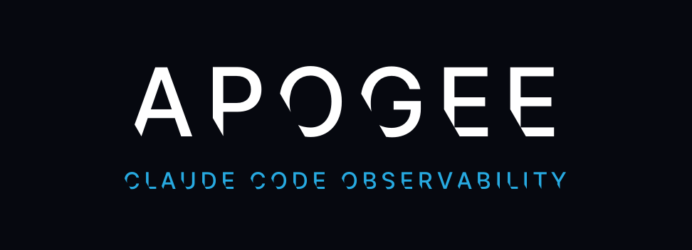
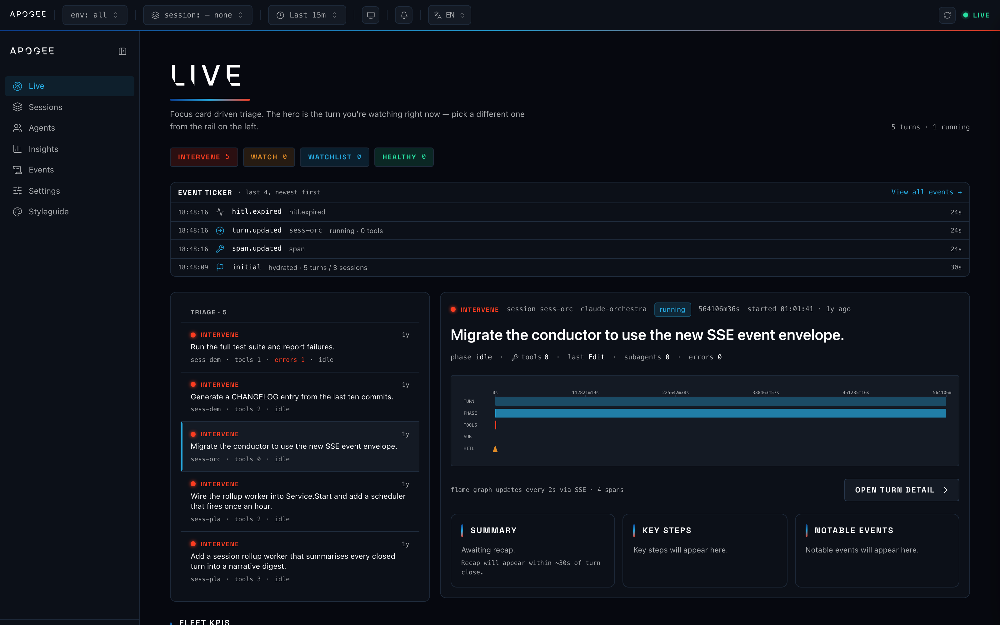
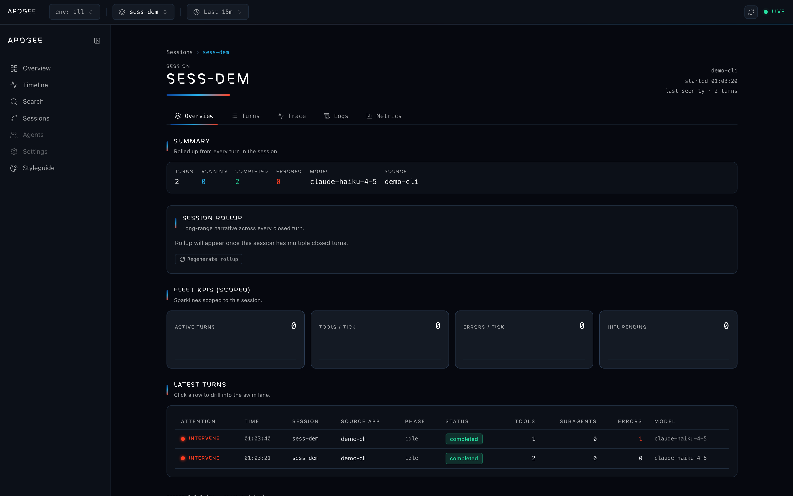
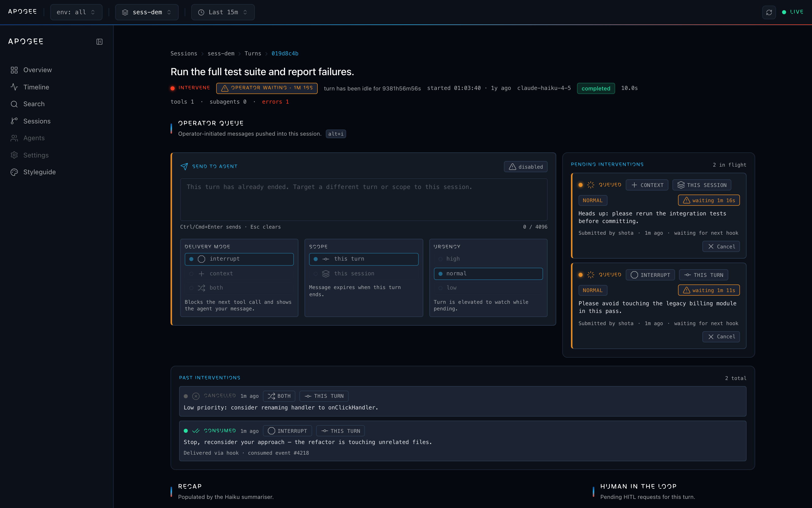

<p align="right">English / <a href="README.ja.md">日本語</a></p>

<p align="center">
  
</p>

<p align="center">
  <strong>The highest vantage point over your Claude Code agents.</strong>
</p>

<p align="center">
  
  <br>
  <em>Live focus dashboard — the running turn is the hero, with the triage rail listing every session with running turns sorted by attention.</em>
</p>

apogee is a single-binary observability dashboard for multi-agent [Claude Code](https://docs.claude.com/en/docs/claude-code) sessions. It captures every hook event, builds OpenTelemetry-shaped traces out of them, stores everything in DuckDB, and streams the result to a dark, NASA-inspired Next.js dashboard that ships embedded in the Go binary.

> [!WARNING]
> apogee is under active development. APIs, schemas, and the on-disk format can break between commits until the first tagged release.

---

## Why apogee

Running multi-agent Claude Code workflows means losing sight of what each agent is actually doing — which tools fire, which permissions get asked, which commands get blocked, which subagent is stuck. apogee answers three questions at a glance:

- **Where should I look right now?** A rule-based attention engine buckets every running turn into `healthy / watchlist / watch / intervene_now` and sorts the live list accordingly, so the noisiest thing is always at the top.
- **What is this turn doing at this exact moment?** Phase heuristics (plan / explore / edit / test / commit / delegate) and a live swim lane render every tool, subagent, and HITL request on a shared time axis.
- **What just happened across the whole session?** A two-tier LLM summarizer fills in a per-turn recap (Haiku) and a per-session narrative rollup (Sonnet), both via the local `claude` CLI — no extra API key required.

### Customising the summarizer

The summarizer reads its language, an optional operator system prompt, and
optional model overrides from the `user_preferences` DuckDB table on every
job. Two ways to manage them:

- The **Settings** page (`/settings`) has a dedicated **Summarizer** section
  with a language toggle, recap / rollup model override inputs, and two
  system-prompt textareas (2048 char limit each).
- A compact **EN / JA language picker** on the top ribbon flips the recap +
  rollup output language in one click — e.g. `EN ▸ JA` switches every new
  recap to Japanese without touching the schema.

Both controls write to the same `PATCH /v1/preferences` endpoint, so
scripted rollouts work too. See [`docs/cli.md`](docs/cli.md#summarizer-preferences)
for the full HTTP contract and validation rules.

---

## Key features

| Surface | What you get |
|---|---|
| Live page | Focus-card driven landing view — the running turn is the hero, with its flame graph, recap headline, phase + current tool, and a CTA to the full turn detail page. A vertical triage rail lists every session with running turns, sorted by attention. |
| Sessions catalog | Searchable, filterable table of every session the collector has seen (Datadog Service Catalog analogue). |
| Agents | Per-agent view with main vs subagent split, invocation counts, rolling duration, parent→child tree. |
| Insights | Aggregate analytics — error rate, duration percentiles, top tools, top phases, watchlist sessions (last 24h). |
| Events browser | `/events/` — paginated table of every stored hook event (50 per page, Prev / Next, URL-backed page number, side-drawer JSON inspector). The Live dashboard's event ticker is now height-capped at 180 px with internal scroll, so new events no longer push the page around. |
| Settings | Collector build metadata + OTel exporter status; config path and daemon/hook install flows surfaced inline. |
| Session detail | Per-session rollup, scoped KPIs, every turn ordered by attention |
| Turn detail | Swim lane, span tree, recap panels, attention reasoning, HITL queue |
| Command palette | Fuzzy search across sessions, scopes, and recent prompts (⌘K) |
| Recap worker | Per-turn structured recap via the local `claude` CLI (Haiku) |
| Rollup worker | Per-session narrative digest via the local `claude` CLI (Sonnet) |
| HITL queue | Permission requests as first-class records with operator decisions |
| Operator interventions | Push text into a live Claude Code session; next `PreToolUse` or `UserPromptSubmit` hook delivers it as `{"decision":"block","reason":...}` or additional context |
| OpenTelemetry | OTLP gRPC/HTTP export, full claude_code.* semconv registry |
| Hooks entry point | `apogee hook --event X` — the binary itself is the hook, zero Python dependency |
| Background service | `apogee daemon {install,uninstall,start,stop,restart,status}` — launchd (macOS) / systemd `--user` (Linux), styled lipgloss output |
| macOS menu bar | `apogee menubar` — native status item polling the local collector |
| Doctor | `apogee doctor` — 7 environment checks (home, claude CLI, db path, config, DB lock, collector, hook install) with `--json` for scripts |
| CLI | `serve`, `init`, `hook`, `daemon`, `status`, `logs`, `open`, `uninstall`, `menubar`, `doctor`, `version` — one binary, no Node or Python runtime |

<p align="center">
  
  
  <br>
  <em>Session rollup and per-turn swim lane — both populated by the local claude CLI.</em>
</p>

---

## Architecture

```
┌────────────────────────┐      ┌──────────────────────────────────────────────┐
│  Claude Code hooks     │      │  apogee collector  (single Go binary)         │
│  `apogee hook --event` │─POST─│                                               │
│  12 hook events        │ JSON │  ┌─ ingest ──────────────────────────────┐   │
└────────────────────────┘      │  │ reconstructor: hook → OTel spans      │   │
                                │  │ per-session agent stack + pending     │   │
                                │  │ tool-use-id map                       │   │
                                │  └────────────────┬──────────────────────┘   │
                                │                   │                           │
                                │  ┌─ store/duckdb ─▼──────────────────────┐   │
                                │  │ sessions · turns · spans · logs ·      │   │
                                │  │ metric_points · hitl_events ·          │   │
                                │  │ session_rollups · interventions ·      │   │
                                │  │ task_type_history                      │   │
                                │  └────────────────┬──────────────────────┘   │
                                │                   │                           │
                                │  ┌─ attention ────▼──────────────────────┐   │
                                │  │ rule engine + phase heuristic +        │   │
                                │  │ history-based pre-emptive watchlist    │   │
                                │  └────────────────┬──────────────────────┘   │
                                │                   │                           │
                                │  ┌─ summarizer ───▼──────────────────────┐   │
                                │  │ recap worker   (Haiku, per turn)       │   │
                                │  │ rollup worker  (Sonnet, per session)   │   │
                                │  └────────────────┬──────────────────────┘   │
                                │                   │                           │
                                │  ┌─ interventions ▼──────────────────────┐   │
                                │  │ queued → claimed → delivered → consumed│  │
                                │  │ atomic claim primitive + sweeper       │   │
                                │  └────────────────┬──────────────────────┘   │
                                │                   │                           │
                                │  ┌─ sse ──────────▼──────────────────────┐   │
                                │  │ hub + /v1/events/stream                │   │
                                │  └────────────────┬──────────────────────┘   │
                                │                   │                           │
                                │  ┌─ telemetry ────▼──────────────────────┐   │
                                │  │ OTel SDK + OTLP gRPC/HTTP exporter     │   │
                                │  └────────────────┬──────────────────────┘   │
                                │                   │                           │
                                │  ┌─ web (Next.js static, embed.FS) ──────▼─┐ │
                                │  │ /            live focus dashboard       │ │
                                │  │ /sessions/   service catalog            │ │
                                │  │ /session?id= session detail + rollup    │ │
                                │  │ /turn?sess=  turn detail + operator queue│ │
                                │  │ /agents      per-agent main/sub view    │ │
                                │  │ /insights    aggregate analytics        │ │
                                │  │ /events/     paginated event browser    │ │
                                │  │ /settings    collector info + OTel      │ │
                                │  └─────────────────────────────────────────┘ │
                                └──────────────────────────────────────────────┘

                                   ┌────────────┐              ┌─────────────┐
                                   │ daemon     │──launchctl──▶│ launchd     │
                                   │ supervisor │──systemctl──▶│ systemd user│
                                   └────────────┘              └─────────────┘
                                   ┌────────────┐
                                   │ menubar    │ (macOS status item, polls /v1/*)
                                   └────────────┘
```

### Data model

apogee treats **one Claude Code user turn as one OpenTelemetry trace**:

```
trace = claude_code.turn  (root span, opens at UserPromptSubmit, closes at Stop)
├── span  claude_code.tool.Bash
├── span  claude_code.tool.Read
├── span  claude_code.subagent.Explore      (subagent child)
│   ├── span  claude_code.tool.Grep
│   └── span  claude_code.tool.Read
├── span  claude_code.hitl.permission       (stays open until a human responds)
└── span event  claude_code.notification
```

Backing storage is DuckDB with OTel-shaped tables for `spans`, `logs`, `metric_points`, plus denormalized `sessions`, `turns`, `hitl_events`, and `session_rollups` for fast dashboard reads. The `turns` row also holds the derived `attention_state`, `attention_reason`, `phase`, and `recap_json` columns. See [`docs/architecture.md`](docs/architecture.md) and [`internal/store/duckdb/schema.sql`](internal/store/duckdb/schema.sql).

---

## Status

| Area | State |
|---|---|
| Monorepo scaffold + design system | shipped |
| Collector core: DuckDB + trace reconstructor | shipped |
| SSE fan-out + live dashboard skeleton | shipped |
| Attention engine + KPI strip | shipped |
| Turn detail + swim lane + filter chips | shipped |
| LLM summarizer (Haiku per turn, Sonnet per session) | shipped |
| HITL as structured record | shipped |
| OpenTelemetry semconv registry + OTLP export | shipped |
| Embedded frontend + CLI distribution | shipped |
| README + screenshots + session rollup polish | shipped |
| Operator interventions (backend + UI) | shipped |
| Go-native hook, Python library removed | shipped |
| Daemon (launchd / systemd `--user`) | shipped |
| macOS menu bar app | shipped |
| UI redesign — Live focus, proper information architecture | shipped |

See [open pull requests](https://github.com/BIwashi/apogee/pulls) for what is actively landing next.

---

## Quickstart

```sh
# 1. Install (Homebrew tap, go install, or build from source).
brew install BIwashi/tap/apogee
# or
go install github.com/BIwashi/apogee/cmd/apogee@latest

# 2. Start the collector and install hooks once for every project on this machine.
apogee serve &
apogee init

# 3. Open the dashboard.
open http://localhost:4100
```

That's it. `apogee init` defaults to **user scope** (`~/.claude/settings.json`), so every Claude Code session on this machine reports into the same collector. The `source_app` label is derived dynamically at hook firing time from:

1. `$APOGEE_SOURCE_APP` — explicit override.
2. `basename $(git rev-parse --show-toplevel)` — when the session is inside a git repository.
3. `basename $PWD` — fallback.

So starting `claude` in `~/work/newmo-backend` labels every event `source_app=newmo-backend`, and starting `claude` in `~/work/apogee` labels every event `source_app=apogee`, automatically, with no reconfiguration.

Pin a fixed label with `apogee init --source-app my-project` when you want to override the runtime derivation. Per-project installs are still available via `apogee init --scope project`.

> [!NOTE]
> `go install` produces a binary whose embedded dashboard is a placeholder page: the API is fully functional, but the UI is a stub that instructs you to run `make web-build` locally or install a release binary. This is because the Next.js static export is not distributed through the Go module proxy. `brew install` and the release tarballs always carry the full dashboard.

Once the collector is running, restart Claude Code in any project and every hook event begins streaming into the dashboard.

---

## Configuration

apogee reads an optional TOML file at `~/.apogee/config.toml`. Every value has a default so the file is purely additive.

```toml
[telemetry]
enabled       = true
endpoint      = "https://otlp.example.com"
protocol      = "grpc"           # "grpc" or "http"
service_name  = "apogee"
sample_ratio  = 1.0

[summarizer]
enabled       = true
recap_model   = "claude-haiku-4-5"
rollup_model  = "claude-sonnet-4-6"
concurrency   = 1
timeout_seconds = 120

[daemon]
label         = "dev.biwashi.apogee"
addr          = "127.0.0.1:4100"
db_path       = "~/.apogee/apogee.duckdb"
log_dir       = "~/.apogee/logs"
keep_alive    = true
run_at_load   = true
```

Every value is also overridable via environment variables (e.g. `APOGEE_RECAP_MODEL`, `APOGEE_ROLLUP_MODEL`, `OTEL_EXPORTER_OTLP_ENDPOINT`). See `internal/summarizer/config.go` and `internal/telemetry/config.go` for the full list.

---

## OpenTelemetry integration

Every reconstructor write is mirrored onto a real OTel span via the SDK, so apogee doubles as an OTLP source for any backend (Tempo, Honeycomb, Datadog, etc.). The `claude_code.*` attributes follow a versioned semconv registry shipped in [`semconv/`](semconv/) and documented in [`docs/otel-semconv.md`](docs/otel-semconv.md). Set `OTEL_EXPORTER_OTLP_ENDPOINT` (or the TOML equivalent) and the collector exports automatically.

---

## Repository layout

```
cmd/apogee/         Go entry point (CLI + embedded server)
internal/
  attention/        rule engine, phase heuristic, history reader
  cli/              cobra commands (serve / init / hook / daemon /
                    status / logs / open / uninstall / menubar /
                    doctor / version)
  collector/        chi router, server wiring, SSE endpoint
  daemon/           launchd / systemd --user supervisor
  hitl/             HITL service: lifecycle, expiration, response API
  ingest/           hook payload types, stateful trace reconstructor
  interventions/    operator interventions service (queued → consumed)
  metrics/          background sampler writing to metric_points
  otel/             OTel-shaped Go models
  sse/              fan-out hub + event envelopes
  store/duckdb/     DuckDB schema + queries + migrations
  summarizer/       recap worker (Haiku) + rollup worker (Sonnet)
  telemetry/        OTel SDK provider, OTLP exporter
  webassets/        embed.FS for the Next.js static export
  version/          build-version constant
web/                Next.js 16 dashboard (App Router, Tailwind v4)
  app/              routes and React components
  app/lib/          typed API client, SWR hooks, design tokens
  public/fonts/     Space Grotesk display font (SIL OFL 1.1)
assets/branding/    apogee banner, logo, and icon
assets/screenshots/ committed dashboard screenshots
scripts/            screenshot capture (playwright) and fixtures
semconv/            OpenTelemetry semantic conventions for claude_code.*
                    (`apogee hook` is the hook entry point — no hooks/
                    directory, no Python dependency)
docs/               architecture, CLI, hooks, data-model, design-tokens,
                    daemon, menubar, interventions, otel-semconv, and
                    Japanese mirror under docs/ja/
.github/workflows/  CI (Go vet/build/test, web typecheck/lint/build)
```

---

## Local development

Requirements: Go 1.24+, Node 20+, and a C toolchain (DuckDB is accessed through `github.com/marcboeker/go-duckdb/v2`, which is cgo).

```sh
# Go
go build ./...
go vet ./...
go test ./... -race -count=1

# Web (from web/)
npm install
npm run dev       # Next.js dev server on http://localhost:3000
npm run typecheck
npm run lint
npm run build

# Run the collector (from repo root)
go run ./cmd/apogee serve --addr :4100 --db .local/apogee.duckdb
```

The collector by itself is just a server — the dashboard will stay empty until a Claude Code session is wired to report events into it. After the collector is up, install the hooks once at user scope using the **local** binary (not the brew-installed one) so every Claude Code session on this machine streams into your dev collector:

```sh
# After the collector is running, install hooks once at user scope.
make build                    # produces ./bin/apogee
./bin/apogee init             # writes ~/.claude/settings.json
```

After that, `claude` started in any project reports into the local collector and the dashboard lights up.

Or use the Makefile:

```sh
make build            # builds ./bin/apogee
make run-collector    # runs the collector against .local/apogee.duckdb
make test             # go vet + race tests
make dev              # collector and Next.js dev server together
```

`make dev` already starts both the collector and the Next.js dev server, so `make dev` + `./bin/apogee init` is the minimal setup for a new contributor.

> If `make dev` fails with *"address already in use"* on `:4100`, an old collector is still bound to the port. Find it with `lsof -nP -iTCP:4100 -sTCP:LISTEN` and stop it with `pkill -f "apogee serve"`.

---

## Run apogee as a background service

Once you have apogee installed, register it as a launchd (macOS) or systemd user (Linux) service so it starts on every login:

```sh
apogee daemon install
apogee daemon start
apogee daemon status
```

`apogee daemon install` prints a styled success box (NO_COLOR=1 sample shown — colors are bold by default in a TTY):

```
╭───────────────────────────────────────────────────────────────────────╮
│ ✓ daemon installed                                                    │
│                                                                       │
│ Label:      dev.biwashi.apogee                                        │
│ Unit path:  /Users/me/Library/LaunchAgents/dev.biwashi.apogee.plist   │
│ Collector:  http://127.0.0.1:4100                                     │
│ Logs:       /Users/me/.apogee/logs/apogee.{out,err}.log               │
│                                                                       │
│ The daemon will start automatically on next login. To start it now:   │
│   apogee daemon start                                                 │
╰───────────────────────────────────────────────────────────────────────╯
```

`apogee daemon status` renders a Daemon box (info border) and a Collector box (success border when reachable, error border when unreachable):

```
Daemon: dev.biwashi.apogee
╭─────────────────────────────────────────────────────────────────────────╮
│ Status:      running                                                    │
│ Installed:   yes                                                        │
│ Loaded:      yes                                                        │
│ Running:     yes                                                        │
│ PID:         12345                                                      │
│ Started at:  2026-04-15 13:01:20                                        │
│ Uptime:      1h 12m 4s                                                  │
│ Last exit:   0                                                          │
│ Unit path:   /Users/me/Library/LaunchAgents/dev.biwashi.apogee.plist    │
│ Logs:        ~/.apogee/logs/apogee.{out,err}.log                        │
╰─────────────────────────────────────────────────────────────────────────╯

Collector: http://127.0.0.1:4100
╭───────────────────────────────────────────────╮
│ Endpoint:  http://127.0.0.1:4100              │
│ Health:    ok                                 │
│ Detail:    ok (HTTP 200, 3 ms)                │
│ Latency:   3ms                                │
╰───────────────────────────────────────────────╯
```

Stop, restart, and tail logs the same way:

```sh
apogee daemon stop      # ✓ daemon stopped (dev.biwashi.apogee)
apogee daemon restart   # ✓ daemon restarted (dev.biwashi.apogee)
apogee logs -f          # tail ~/.apogee/logs/apogee.{out,err}.log
apogee open             # opens http://127.0.0.1:4100 in your browser
```

`apogee logs -f` tails both `apogee.out.log` and `apogee.err.log` from `~/.apogee/logs/`, seeded with the last 50 lines:

```
==> /Users/me/.apogee/logs/apogee.out.log <==
{"time":"2026-04-15T13:01:38+09:00","level":"INFO","msg":"collector listening","addr":"127.0.0.1:4100"}
{"time":"2026-04-15T13:01:38+09:00","level":"INFO","msg":"summarizer: starting","recap_model":"claude-haiku-4-5"}
```

`apogee open` is a thin wrapper over `open` (macOS) / `xdg-open` (Linux) that prints the URL when the system helper is unavailable:

```
Opening http://127.0.0.1:4100/
```

To remove apogee entirely:

```sh
apogee uninstall            # stops daemon, removes hooks, prompts before deleting data
apogee uninstall --purge    # also wipes ~/.apogee
```

`apogee daemon uninstall` (used by `apogee uninstall` internally) renders an info box:

```
╭─────────────────────────────╮
│ daemon uninstalled          │
│                             │
│ Label:  dev.biwashi.apogee  │
╰─────────────────────────────╯
```

The unit file lives at `~/Library/LaunchAgents/dev.biwashi.apogee.plist` on macOS and `~/.config/systemd/user/apogee.service` on Linux. See [`docs/daemon.md`](docs/daemon.md) for the full operator cheatsheet and [`docs/doctor.md`](docs/doctor.md) for the doctor checks reference.

To regenerate the screenshots committed under `assets/screenshots/`:

```sh
bash scripts/capture-screenshots.sh
```

The script boots the collector against an in-memory DB, posts a fixture batch, and drives Chromium via playwright.

---

## Troubleshooting

### DuckDB lock conflict

Apogee writes a sidecar lock file (`<db>.apogee.lock`) and a sidecar pid file (`<db>.apogee.pid`) next to its DuckDB store. If you accidentally start a second collector pointed at the same DB, the second invocation exits 1 with a styled error box instead of the raw driver error:

```
╭──────────────────────────────────────────────────────────╮
│ Another apogee process is already using the DuckDB file. │
│                                                          │
│ Path:    /Users/me/.apogee/apogee.duckdb                 │
│ Holder:  apogee (pid 12345)                              │
│                                                          │
│ To fix:                                                  │
│   1. apogee daemon stop                                  │
│   2. or: kill 12345                                      │
│   3. or: apogee serve --db <alt path>                    │
╰──────────────────────────────────────────────────────────╯
```

Run `apogee daemon stop` (or `kill <pid>` for an unmanaged collector), then re-run the command. The holder PID is detected via `lsof -nP <db>` when available, with a fallback to the pid file.

### Daemon won't start

- `apogee daemon status` prints the install + load state and the collector reachability box.
- `apogee logs -f` tails `~/.apogee/logs/apogee.{out,err}.log` from the daemon's stdout/stderr.
- On launchd: check `launchctl print gui/$(id -u)/dev.biwashi.apogee` for the supervisor's view.
- On systemd: `journalctl --user -u apogee.service -f` for the unit's logs.

### Hook not firing

Run `apogee doctor` — the `hook_install` check reads `~/.claude/settings.json` and verifies every event in `internal/cli/init.go::HookEvents` points at the apogee binary:

```
apogee doctor

  ✓ /Users/me/.apogee writable
  ✓ claude CLI on PATH (/Users/me/.local/bin/claude)
  ✓ default db path /Users/me/.apogee/apogee.duckdb
  ✓ no config file (defaults in use) (/Users/me/.apogee/config.toml)
  ✓ DuckDB file is unlocked
  ⚠ collector not running (http://127.0.0.1:4100/v1/healthz)
  ✓ apogee hook installed for 12/12 events

5 ok · 1 warning · 0 errors
```

`apogee doctor --json` emits the same checks as a JSON array suitable for CI / scripts / `apogee menubar`.

If `hook_install` reports `partial` or `missing`, run `apogee init --force` to rewrite the entries.

---

## Credits

- **Display font**: [Space Grotesk](https://github.com/floriankarsten/space-grotesk) by Florian Karsten, [SIL Open Font License 1.1](https://scripts.sil.org/OFL).
- **Body font**: system stack (San Francisco / Segoe UI / Helvetica Neue).
- **Icons**: [lucide](https://lucide.dev) (ISC).
- **Go libraries**: see [`docs/credits.md`](docs/credits.md) for the full list.
- **Inspirations**: [aperion](https://github.com/BIwashi/aperion), [mitou-adv](https://github.com/MichinokuAI/mitou-adv), [disler's observability prototype](https://github.com/disler/claude-code-hooks-multi-agent-observability), and Datadog APM's control plane.

apogee does not bundle any NASA brand asset. The color palette is inspired by NASA Artemis-program hues but uses generic hex values and makes no affiliation claim.

---

## License

Apache License 2.0. See [LICENSE](LICENSE).
